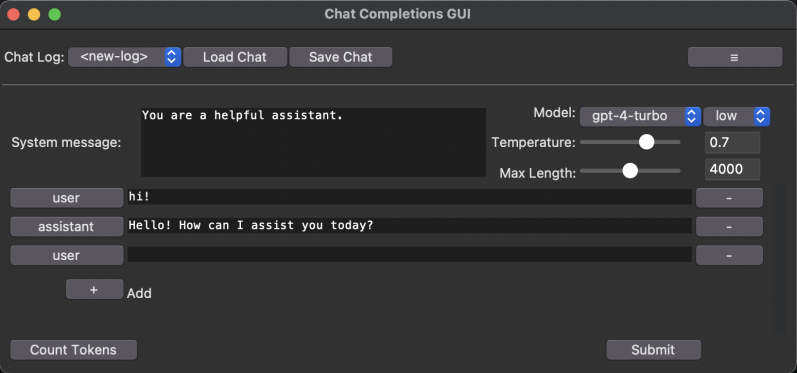

# Chat Completions GUI

This is a simple Graphical User Interface (GUI) application for working with the OpenAI API, allowing you to use OpenAI's Chat Completions (GPT-3.5-turbo and GPT-4) in your local desktop environment.

## Getting Started

### Prerequisites

- Python 3.7 or higher
- An OpenAI API key (get one from https://beta.openai.com/signup/)

### Installing

1. Clone the repository:

    `git clone https://github.com/yourusername/chat-completions-gui.git`\
    `cd chat-completions-gui`

2. Install the required packages:

    `pip install -r requirements.txt`

3. Run the application:

    `python chat.py`

4. Enter your OpenAI API key and Organization ID (if applicable) in the configuration fields, and click "Save API Key".

## Features

- Interact with GPT-3.5-turbo and GPT-4 models
- Easily add, edit, and delete chat messages
- Save and load chat logs
- Customizable system message and model selection

## License

This project is licensed under the MIT License - see the [LICENSE](LICENSE) file for details.

## Disclaimer

This project is not officially affiliated with or endorsed by OpenAI. It is an independent project developed by the Multitude VR team, licensed under the MIT License. The use of the OpenAI API is subject to OpenAI's terms and policies, which can be found at https://www.openai.com/usage-policies/.

Please be aware that this tool does not itself collect or store any data; all data exchanged with the OpenAI API is handled directly by OpenAI. As a developer using this tool, it is your responsibility to ensure compliance with OpenAI's terms and policies. We kindly ask you to review OpenAI's policies and understand the implications of using the API with your own keys.